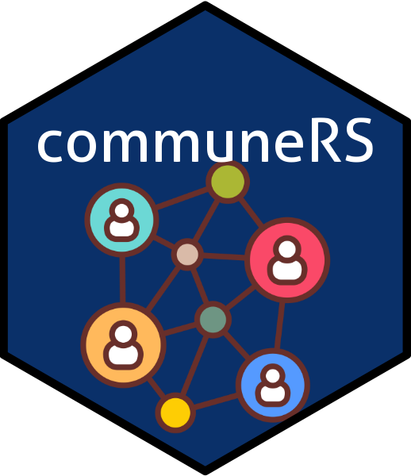

# CommuneRS: A Community of Research Software Communities

## About

[CommuneRS website](https://ellakaye.github.io/communers/)

This is a [Hack Day](https://www.software.ac.uk/cw24-hack-day) project from [Collaborations Workshop 2024](https://www.software.ac.uk/workshop/collaborations-workshop-2024-cw24) organised by the [Software Sustainability Institute](https://www.software.ac.uk).

**Community building is hard.**

It’s difficult for small groups to get off the ground and maintain momentum once running. 
Many groups struggle with the same issues. 
Solutions can benefit the wider community -- so how can community leaders avoid feelings of isolation and reinventing the wheel, and share knowledge and provide support across communities? Moreover, there may be small communities with overlapping interests who are not aware of each other.

*We want community leaders to be able to find each other, support each other and collaborate.*

## Usage

The [CommuneRS website](https://ellakaye.github.io/communers/) provides

- A database of communities
- A channel for community leaders to communicate
- A list of resources that support community building

## Future Work

- [ ] Integrate an online form to the website so that anyone can easily contribute validated data to the CommuneRS index
- [ ] Connect community leaders and foster a network for sharing experiences 
- [ ] Curate a comprehensive list of resources for community building

## Contributing

We strongly encourage [contributions](CONTRIBUTING.md) to the database and the resource list. The best way to do that at the moment is by opening an issue or pull request in the [GitHub repo](https://github.com/EllaKaye/communers). In future, we plan to have a Google Form where community leaders can enter their community's details, and have that update the database.

## License

Distributed under the MIT License. See [`LICENSE.md`](https://github.com/EllaKaye/communers/blob/main/LICENSE.md) for more information.

## Contact

This is a [Collaborations Workshop 2024](https://www.software.ac.uk/workshop/collaborations-workshop-2024-cw24) Hack Day project created by

- Ella Kaye (GitHub: @EllaKaye)
- Alessandro Felder (GitHub: @alessandrofelder)
- Dmitry Nikolaenko (GitHub: @parnumeric)
- Saranjeet Kaur (GitHub: @SaranjeetKaur)
- Thomas Zwagerman (GitHub: @thomaszwagerman)
- Jenny Wong (GitHub: @jnywong)
- Rowland Mosbergen (GitHub: @rowlandm)
- Michelle Barker (GitHub: @mdbarker)
- Adamu Habu (GitHub: @habuabba)

Feel free to contact the team by [opening a GitHub issue](https://github.com/EllaKaye/communers/issues/new).

## Code of Conduct

This project follows the [Collaborations Workshop 2024 Code of Conduct](https://www.software.ac.uk/cw24-participation-guidelines).

## Acknowledgement

Logo Icon from [Community manager icons created by Vectors Tank - Flaticon](https://www.flaticon.com/free-icons/community-manager)
